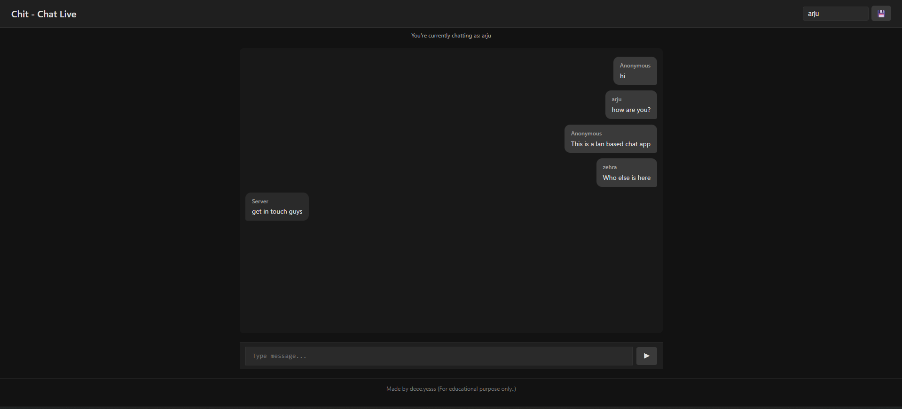

# Chit - Chat Live

A real-time chat application built with **Flask** and **Socket.IO**. Users can set their display name and chat live in a minimal, dark-themed interface.

---

## Features

- Real-time messaging with **Socket.IO**
- Set and update username
- Displays the sender's name on top of each message for easy copying
- Responsive design for both desktop and mobile
- Unread message count shown in the browser tab
- Minimal dark theme for a modern look

---

## Demo Screenshot

  

---

## Technologies Used

- **Frontend**: HTML, CSS, JavaScript
- **Backend**: Python, Flask, Flask-SocketIO
- **Socket.IO**: Real-time communication

---

## Installation

1. Clone the repository:

```bash
git clone https://github.com/yourusername/chit-chat-live.git
cd chit-chat-live
```

2. Create and activate a virtual environment:

### On Linux/Mac
```bash
python3 -m venv venv
source venv/bin/activate
```

### On Windows
```bash
python -m venv venv
venv\Scripts\activate
```
3.Install all dependencies:
```bash
pip install -r requirements.txt
```
## Running the application
```bash
python app.py
```
open your browser and navigate to
```bash
http://localhost:5000
```
The app has two host, localhost and private ip. the private ip is to get ip from your device and host the app within it so that any other device connected to the same network can chat. 